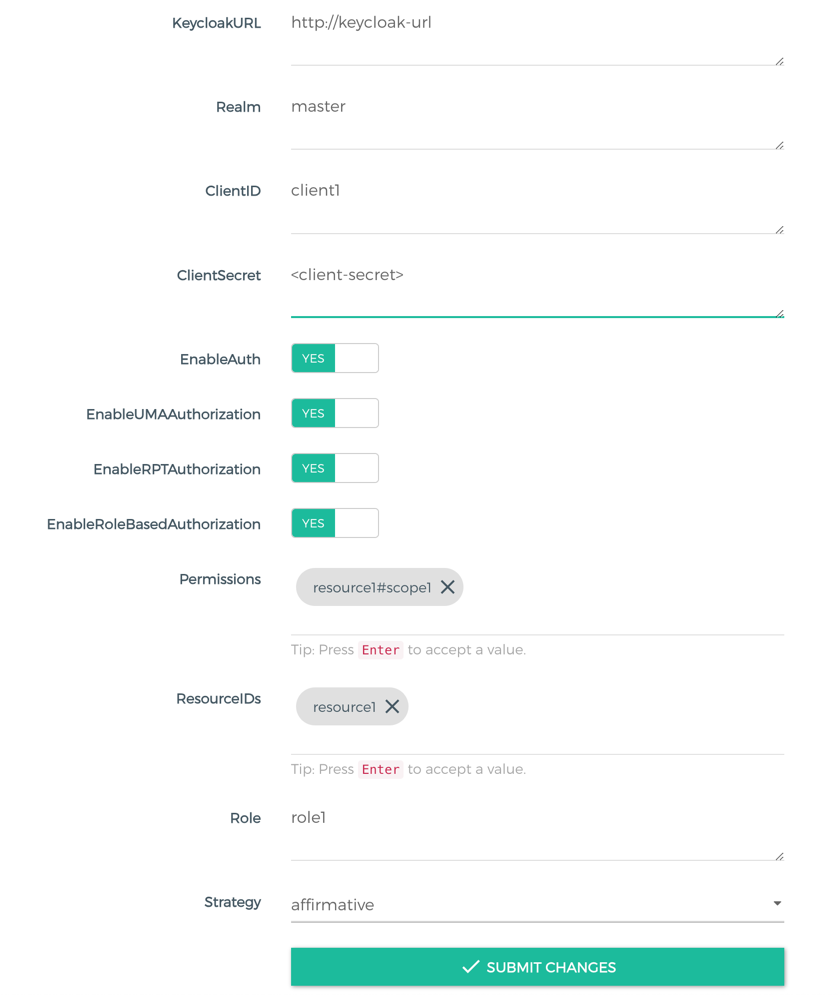
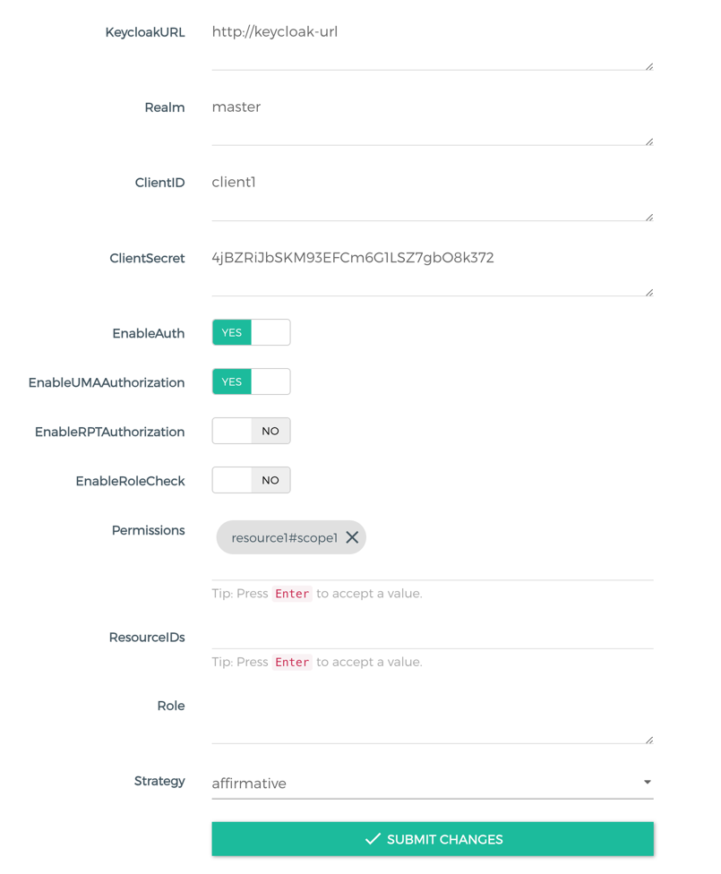
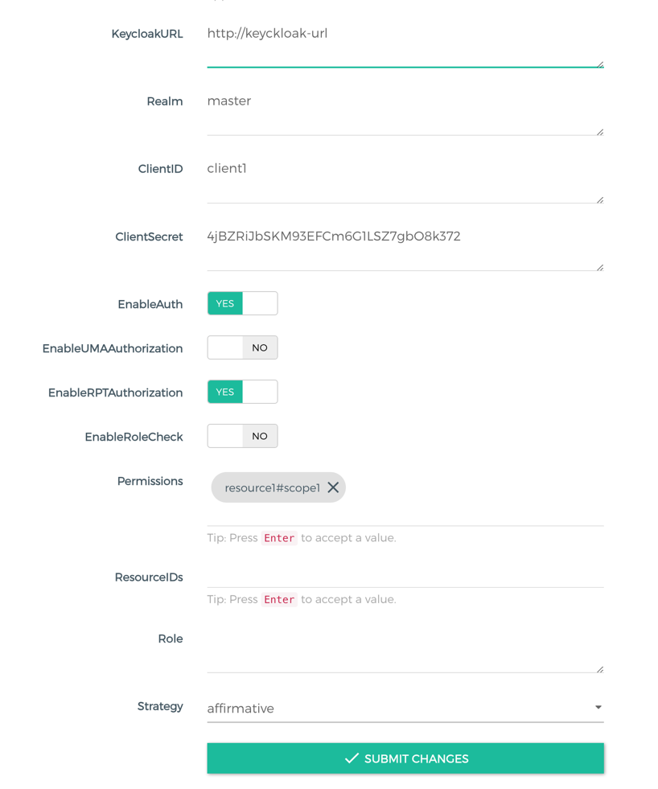
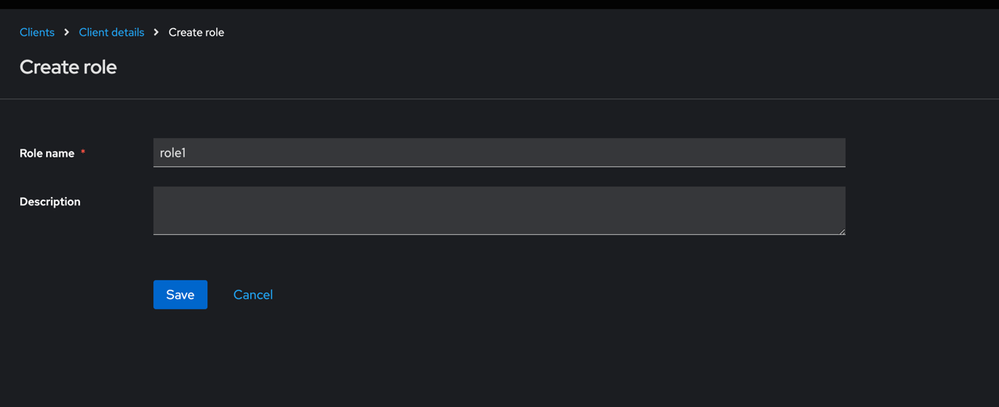
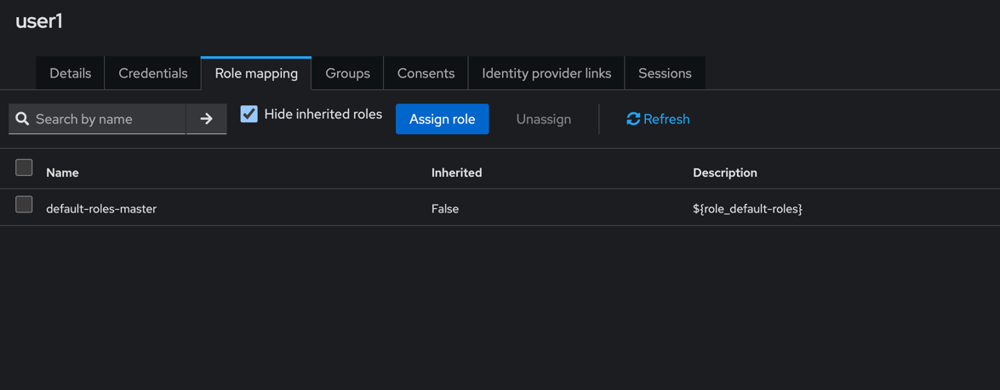
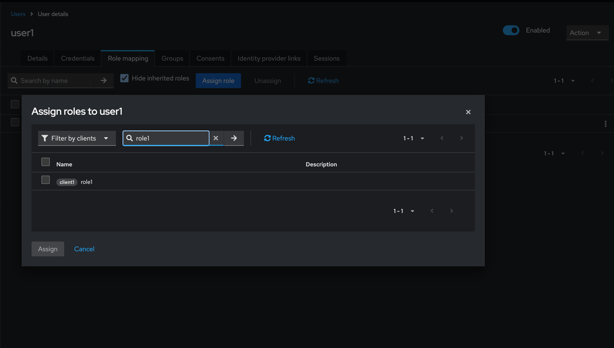

<!-- TOC -->
  * [About](#about)
  * [Author](#author)
  * [Contributors](#contributors)
  * [Requirements](#requirements)
  * [File structure](#file-structure)
  * [Authorization Methods Workflow](#authorization-methods-workflow)
    * [EnableUMAAuthorization](#enableumaauthorization)
    * [EnableRPTAuthorization](#enablerptauthorization)
    * [EnableRoleBasedAuthorization](#enablerolebasedauthorization)
    * [Combined Authorization Workflow](#combined-authorization-workflow)
    * [Key Features](#key-features)
    * [Example Workflow](#example-workflow)
  * [Installation](#installation)
    * [Compiling](#compiling)
    * [ENV Variables required for Kong plugin installation](#env-variables-required-for-kong-plugin-installation)
    * [schema.lua](#schemalua)
      * [Description](#description)
        * [Example Role in Kong:](#example-role-in-kong)
        * [Example Role in Konga:](#example-role-in-konga)
        * [Summary](#summary)
      * [Installation](#installation-1)
    * [Additional installation examples](#additional-installation-examples)
    * [Docker - Kong, Konga & the plugin](#docker---kong-konga--the-plugin)
      * [Examples on how to configure Kong to use the plugin using http requests](#examples-on-how-to-configure-kong-to-use-the-plugin-using-http-requests)
        * [Create a service](#create-a-service)
        * [Create a route for that service](#create-a-route-for-that-service)
        * [Activate the keycloak-guard Plugin for the Service](#activate-the-keycloak-guard-plugin-for-the-service)
        * [Activate the keycloak-guard Plugin to a Specific Route](#activate-the-keycloak-guard-plugin-to-a-specific-route)
      * [Examples on how to configure Kong to use the plugin via Konga](#examples-on-how-to-configure-kong-to-use-the-plugin-via-konga)
  * [Keycloak configuration](#keycloak-configuration)
    * [EnableUMAAuthorization](#enableumaauthorization-1)
      * [Create User example](#create-user-example)
      * [Create Scope example](#create-scope-example)
      * [Create Resource example](#create-resource-example)
      * [Create Client Policy example](#create-client-policy-example)
      * [Create Permission](#create-permission)
      * [Create an Audience scope mapper for client2](#create-an-audience-scope-mapper-for-client2)
      * [How to use](#how-to-use)
        * [Fetch the access token for the user:](#fetch-the-access-token-for-the-user)
        * [Use the access token to make a request through kong.](#use-the-access-token-to-make-a-request-through-kong-)
    * [EnableRPTAuthorization](#enablerptauthorization-1)
      * [Create Scope Example](#create-scope-example-1)
      * [Create Resource Example](#create-resource-example-1)
      * [Create Client Policy Example](#create-client-policy-example-1)
      * [Create Permission](#create-permission-1)
      * [How to use](#how-to-use-1)
        * [Kong plugin configuration for the RPT workflow](#kong-plugin-configuration-for-the-rpt-workflow-)
      * [Request the permission ticket](#request-the-permission-ticket)
      * [Obtain the Client Credentials Token for "client2"](#obtain-the-client-credentials-token-for-client2)
      * [Use the Client Credentials Token and the Permission ticket to obtain the RPT Token](#use-the-client-credentials-token-and-the-permission-ticket-to-obtain-the-rpt-token)
      * [Use the RPT token to make authorized calls to client1 (through Kong)](#use-the-rpt-token-to-make-authorized-calls-to-client1-through-kong)
    * [EnableRoleBasedAuthorization](#enablerolebasedauthorization-1)
      * [Create User example](#create-user-example-1)
      * [Create an Audience scope mapper for client2](#create-an-audience-scope-mapper-for-client2-1)
      * [Create a new role for client1](#create-a-new-role-for-client1)
      * [Assign the newly created role to a user](#assign-the-newly-created-role-to-a-user)
      * [How to use](#how-to-use-2)
        * [Kong plugin configuration for the Role Based Authorization workflow](#kong-plugin-configuration-for-the-role-based-authorization-workflow)
        * [Obtain user access token (for user1, client2)](#obtain-user-access-token-for-user1-client2)
        * [Use the Access token that you have just obtained to make authorized calls to client1 (through Kong)](#use-the-access-token-that-you-have-just-obtained-to-make-authorized-calls-to-client1-through-kong)
  * [Known issues:](#known-issues)
<!-- TOC -->

## About
Kong plugin for Keycloak that manages both authentication and authorization for API requests.
This document explains how to set up and use the Keycloak Guard plugin with Kong and Konga.

## Author
- Name: Mihai Florentin Mihaila
- Website: https://github.com/mihaiflorentin88

## Contributors
- Name: Mihai Florentin Mihaila
- Website: https://github.com/mihaiflorentin88

## Requirements
While it might work with other versions these are the versions I have tested the plugin with:
- Golang: 1.22.4
- Kong: 3.4.2
- Konga: 0.14.9
- Keycloak: 25.0.1

## File structure

```
├── cmd/ - Contains entry points. Can access both domain and infrastructure components.
├── docs/ - Documentation resources.
├── domain/ - Contains domain components with the strict rule of never using external dependencies.
├── infrastructure/ - Contains logic for external clients like APIs or storage solutions.
└── port/ - Contains Ports(Interfaces)/DTOs.
```

## Authorization Methods Workflow
### EnableUMAAuthorization

- This method verifies UMA permissions locally.
- It requires an access token.
- It uses the provided Resource(s) and Scope(s) along with a defined Strategy.
- The Strategy can be affirmative, consensus, or unanimous and is used to determine how permissions are validated.
- If set to true then the following fields will be made mandatory
  - EnableAuth: Verifies the Authorization Bearer header
  - Permissions: List of permissions. You can provide the permissions following this standard: ResourceName#ScopeName
  - Strategy: you can choose from one of these 3 options Strategy. This option determines how permissions are validated.

### EnableRPTAuthorization
- This method utilizes the UMA permission ticket workflow.
- If the Authorization header is missing in the request, the plugin responds with a permission ticket.
- The requester must convert this permission ticket into an RPT token, which is then used to gain access to the resource.
- if set to true then the following options will be made mandatory
    - EnableAuth: Verifies the Authorization Bearer header
    - ResourceIDs: List of resource ids. 

### EnableRoleBasedAuthorization

- This method verifies if the user has a specified role.
- It requires the `Role` field to be specified.
- It cannot be enabled simultaneously with `EnableRPTAuthorization` or `EnableUMAAuthorization`.
- If set to true, the following fields will be made mandatory:
    - EnableAuth: Verifies the Authorization Bearer header
    - Role: The required role the user must have


### Combined Authorization Workflow

When both authorization methods are enabled, the plugin prioritizes the RPT workflow. Here’s how it operates:

1. Authorization Token Missing or Invalid:
   - The plugin responds with a permission ticket.
   - The client can exchange this permission ticket for an RPT token using the Keycloak Authorization API or use an access token that has the correct permissions.
2. Authorization Header Present:
   - The plugin checks the validity of the access token in the Authorization header.
   - If the access token is valid, it verifies whether the token is an RPT.
   - If the token is not an RPT, the plugin falls back to the UMA Authorization workflow to validate the permissions based on the predefined Resource(s), Scope(s), and Strategy.

This is an example for the response body that will be returned if the Authorization Bearer header is missing or invalid:
```json
{
    "message": "The request is missing the Requesting Party Token (RPT). Please obtain an RPT using the provided permission ticket.",
    "code": 401,
    "permissionTicket": "keycloak-unique-generated-permission-ticket"
}
```

If the permissionTicket key is present in the response then the requester has to generate an RPT. Or if the EnableUMAAuthorization is turned on then the requester can also provide a valid access token.
The RPT will have to be provided as an Authorization Bearer header.

### Key Features

- Priority Handling: Prioritizes the RPT workflow when both methods are enabled, ensuring that clients without valid tokens receive a permission ticket for dynamic access control.
- Fallback Mechanism: Uses UMA Authorization as a fallback to validate non-RPT tokens, ensuring comprehensive access control management.
- Seamless Integration: Integrates both authorization methods seamlessly to provide flexible and robust security mechanisms.

### Example Workflow
1. Request without Authorization Token:
   - The client receives a permission ticket in the response.
   - The client must convert this ticket into an RPT token to access the resource.
2. Request with Valid Access Token:
   - The plugin introspects the token to check its validity and type.
   - If the token is not an RPT, the UMA Authorization workflow is used to validate permissions.

## Installation
### Compiling
```bash
make compile # This only works if you have golang 1.22.4 installed on your system
make docker-compile # This uses a docker container to compile the binary
```
By default, it compiles for linux on amd64 architecture.
If you wish to compile for other platforms or architectures use one of the commands below (requires golang 1.22.4 installed) or you can modify the Makefile and use docker to compile it
```bash
# Windows x86 64 bit
go mod tidy && GOOS=windows GOARCH=amd64 go build -o bin//keycloak-guard-windows-amd64.exe main.go
# Windows ARM 64 bit
go mod tidy && GOOS=windows GOARCH=arm64 go build -o bin//keycloak-guard-windows-arm64.exe main.go

# MacOS
# MacOS Darwin x86 64 bit
go mod tidy && GOOS=darwin GOARCH=amd64 go build -o bin//keycloak-guard-darwin-amd64 main.go
# MacOS Darwin ARM 64 bit
go mod tidy && GOOS=darwin GOARCH=arm64 go build -o bin//keycloak-guard-darwin-arm64 main.go

# Linux
# Linux x86 64 bit
go mod tidy && GOOS=linux GOARCH=amd64 go build -o bin//keycloak-guard-linux-amd64 main.go
# Linux ARM 64 bit
go mod tidy && GOOS=linux GOARCH=arm64 go build -o bin//keycloak-guard-linux-arm64 main.go
```

### ENV Variables required for Kong plugin installation
```bash
# This assumes that the name of your binary is keycloak-guard
export KONG_PLUGINSERVER_NAMES="keycloak-guard"
export KONG_PLUGINSERVER_KEYCLOAK_GUARD_START_CMD="/usr/bin/keycloak-guard -kong-prefix /tmp"
export KONG_PLUGINSERVER_KEYCLOAK_GUARD_QUERY_CMD="/usr/bin/keycloak-guard -dump"
export KONG_PLUGINSERVER_KEYCLOAK_GUARD_SOCKET="/tmp/keycloak-guard.socket"
export KONG_PLUGINSERVER_KEYCLOAK_GUARD_START_TIMEOUT="10"
export KONG_PLUGINS="bundled,keycloak-guard"
```

### schema.lua

#### Description

schema.lua is a Lua script used in Kong plugins to define the configuration schema for the plugin. It plays a crucial role in the validation and management of the plugin’s configuration settings. Here’s a concise explanation of its role:
1. Define Configuration Structure: schema.lua specifies the structure of the configuration options that users can set for the plugin. This includes defining fields, their types, default values, and validation rules.
2. Ensure Validity: It ensures that the configuration provided by the user is valid and meets the expected criteria before the plugin is executed. This validation helps prevent runtime errors due to incorrect configurations.
3. Integration with Konga: When using Konga, a UI for managing Kong, schema.lua helps Konga understand the configuration options available for the plugin, allowing for a user-friendly interface to set and modify these options.

##### Example Role in Kong:

1. Field Definitions: Specifies fields such as api_key, timeout, and their respective data types (string, number, etc.).
2. Validation: Enforces rules like required fields, field length, and acceptable value ranges.
3. Defaults: Provides default values for configuration settings if the user does not specify them.

##### Example Role in Konga:

UI Integration: Enables Konga to dynamically generate forms and input fields based on the plugin’s schema, allowing users to configure the plugin through the Konga interface easily.

##### Summary
In summary, schema.lua is essential for defining, validating, and managing the configuration of Kong plugins, ensuring smooth integration and functionality within both Kong and Konga environments.

#### Installation
Copy the schema.lua file from the repository root to this path: ```/usr/local/share/lua/5.1/kong/plugins/keycloak-guard/schema.lua```

### Additional installation examples
You can find more examples on how to setup the plugin and the [schema.lua](./schema.lua) inside the [docker-compose.yaml](./docker-compose.yaml) file.

### Docker - Kong, Konga & the plugin
The repository includes a [docker-compose.yaml](./docker-compose.yaml) file that sets up a fully functional environment with Kong, Konga, and the custom plugin installed. To manage these services, you can use the provided Makefile commands:
```bash
make kong-start # Start the Kong and Konga containers
make kong-stop # Stop the Kong and Konga containers
make docker-clean-up # Stop the containers, remove all images and networks
```
#### Examples on how to configure Kong to use the plugin using http requests
To create a service, add a route, and assign the keycloak-guard plugin in Kong, you can use the following curl commands:
##### Create a service
```bash
curl -i -X POST http://localhost:8001/services/ \
  --data name=example-service \
  --data url=http://your.service
```
##### Create a route for that service
```bash
curl -i -X POST http://localhost:8001/services/example-service/routes \
  --data 'paths[]=/example'
```
##### Activate the keycloak-guard Plugin for the Service
```bash
curl -i -X POST http://localhost:8001/services/example-service/plugins \
  --data name=keycloak-guard \
  --data config.KeycloakURL=http://your-keycloak-url \
  --data config.Realm=your-realm \
  --data config.ClientID=your-client-id \
  --data config.ClientSecret=your-client-secret \
  --data config.EnableAuth=true \ # Optional if EnableUMAAuthorization and EnableRPTAuthorization are set to false 
  --data config.EnableUMAAuthorization=true \ # Optional
  --data config.Permissions[]=resouceName#exampleScope \ # Optional if EnableUMAAuthorization is set to false
  --data config.Strategy=affirmative \ # Optional if EnableUMAAuthorization is set to false
  --data config.EnableRPTAuthorization=true \ # Optional
  --data config.ResourceIDs[]=resource-id-1 \ # Optional if EnableRPTAuthorization is set to false
  --data config.ResourceIDs[]=resource-id-2 # # Optional if EnableRPTAuthorization is set to false
  --data config.EnableRoleBasedAuthorization=true # Optional if EnableRoleBasedAuthorization is set to true then EnableAuth has to be set to true and a Role has to be added. Also both EnableUMAAuthorization and EnableRPTAuthorization need to be set to false
  --data config.Role=role1 # Optional requires EnableRoleBasedAuthorization to be set to true
```

##### Activate the keycloak-guard Plugin to a Specific Route
```bash
curl -i -X POST http://localhost:8001/routes/{route_id}/plugins \
  --data name=keycloak-guard \
  --data config.KeycloakURL=http://your-keycloak-url \
  --data config.Realm=your-realm \
  --data config.ClientID=your-client-id \
  --data config.ClientSecret=your-client-secret \
  --data config.EnableAuth=true \ # Optional if EnableUMAAuthorization and EnableRPTAuthorization are set to false 
  --data config.EnableUMAAuthorization=true \ # Optional
  --data config.Permissions[]=resouceName#exampleScope \ # Optional if EnableUMAAuthorization is set to false
  --data config.Strategy=affirmative \ # Optional if EnableUMAAuthorization is set to false
  --data config.EnableRPTAuthorization=true \ # Optional
  --data config.ResourceIDs[]=resource-id-1 \ # Optional if EnableRPTAuthorization is set to false
  --data config.ResourceIDs[]=resource-id-2 # # Optional if EnableRPTAuthorization is set to false
  --data config.EnableRoleBasedAuthorization=true # Optional if EnableRoleBasedAuthorization is set to true then EnableAuth has to be set to true and a Role has to be added. Also both EnableUMAAuthorization and EnableRPTAuthorization need to be set to false
  --data config.Role=role1 # Optional requires EnableRoleBasedAuthorization to be set to true
```
#### Examples on how to configure Kong to use the plugin via Konga
This [screenshot](docs/resources/konga_setup.png) contains an example on how to setup the plugin via Konga with all features toggled on.


## Keycloak configuration
I will be using "client1" and "client2" in my examples. "client2" will be the client sending the requests to client1
### EnableUMAAuthorization
For this workflow to work, you will be required to have the following Keycloak configuration:
1. **client2:**
   - create an audience scope mapper
2. **Realm:**
   - create an active user or use an existing one.
3. **client1:**
   - a new scope
   - a new resource
   - a new client policy 
   - a new permission 

#### Create User example
Create the user:

Set the user password

#### Create Scope example

#### Create Resource example

#### Create Client Policy example

#### Create Permission

#### Create an Audience scope mapper for client2

#### How to use
##### Fetch the access token for the user:
```bash
curl --location 'http://keycloak-url/realms/<realm>/protocol/openid-connect/token' \
--header 'Content-Type: application/x-www-form-urlencoded' \
--data-urlencode 'grant_type=password' \
--data-urlencode 'client_id=client2' \
--data-urlencode 'username=user1' \
--data-urlencode 'password=userpassword' \
--data-urlencode 'client_secret=YOie4lyoXakCXDuP7jRCsUM4Xx4OxUOB'
```
##### Use the access token to make a request through kong. 
The keycloak-gateway plugin has to be enabled and configured for this workflow.

For more detailed setup and usage instructions, refer to the [Additional installation examples](#additional-installation-examples) section.
```bash
curl --location 'http://kong-hostname:8000/test' \
--header 'Authorization: Bearer <accessToken>'
```
### EnableRPTAuthorization
For this workflow to work, you will be required to have the following Keycloak configuration:
1. **client1:**
   - a new scope
   - a new resource
   - a new client policy
   - a new permission

#### Create Scope Example

#### Create Resource Example

#### Create Client Policy Example

#### Create Permission

#### How to use
##### Kong plugin configuration for the RPT workflow 

#### Request the permission ticket
Any call that doesn't have an active RPT token will return a response that will contain a permission ticket

```bash
curl --location 'http://kongHostname:8000/test'
```

The response status code will be 401 and the response body will be like in the example below:
```json
{
    "message": "The request is missing the Requesting Party Token (RPT). Please obtain an RPT using the provided permission ticket.",
    "code": 401,
    "permissionTicket": "<permission_ticket>"
}
```
#### Obtain the Client Credentials Token for "client2"
```bash
curl --location 'http://keycloak-url/realms/<realm>/protocol/openid-connect/token' \
--header 'Content-Type: application/x-www-form-urlencoded' \
--data-urlencode 'grant_type=client_credentials' \
--data-urlencode 'client_id=client2' \
--data-urlencode 'client_secret=YOie4lyoXakCXDuP7jRCsUM4Xx4OxUOB'
```
The response should contain the Client Credentials token (access_token):
```json
{
    "access_token": "<client_credentials_token>",
    "expires_in": 86400,
    "refresh_expires_in": 0,
    "token_type": "Bearer",
    "not-before-policy": 0,
    "scope": "email profile"
}
```

#### Use the Client Credentials Token and the Permission ticket to obtain the RPT Token
```bash
curl --location 'http://keycloak-url/realms/<realm>/protocol/openid-connect/token' \
--header 'Content-Type: application/x-www-form-urlencoded' \
--header 'Authorization: Bearer <client_credentials_token>' \
--data-urlencode 'grant_type=urn:ietf:params:oauth:grant-type:uma-ticket' \
--data-urlencode 'ticket=<permission_ticket>'
```
The response will contain the RPT token that will be used authorize further calls to our application (through kong).
```json
{
    "upgraded": false,
    "access_token": "<rpt_token>",
    "expires_in": 86400,
    "refresh_expires_in": 0,
    "token_type": "Bearer",
    "not-before-policy": 0
}
```
#### Use the RPT token to make authorized calls to client1 (through Kong)
```bash
curl --location 'http://kongHostname:8000/test' \
--header 'Authorization: Bearer <rpt_token>'
```

### EnableRoleBasedAuthorization
For this workflow to work, you will be required to have the following Keycloak configuration:
1. **Realm:**
   - create an active user or use an existing one.
2. **client1:**
   - create a new role
   - assign the new role to a username
3. **client2:**
   - create an audience scope mapper

#### Create User example
Create the user:

Set the user password


#### Create an Audience scope mapper for client2


#### Create a new role for client1


#### Assign the newly created role to a user
Role mapping tab for a user:

Assign a role to that user:


#### How to use
##### Kong plugin configuration for the Role Based Authorization workflow
- EnableAuth has to be enabled
- EnableUMAAuthorization has to be disabled
- EnableRPTAuthorization has to be disabled
- EnableRoleBasedAuthorization has to be enabled
- Role (field) has to contain the name for the role you want to allow access for (role1)


##### Obtain user access token (for user1, client2)
```bash
curl --location 'http://keycloak-url/realms/<realm>/protocol/openid-connect/token' \
--header 'Content-Type: application/x-www-form-urlencoded' \
--data-urlencode 'grant_type=password' \
--data-urlencode 'client_id=client2' \
--data-urlencode 'username=user1' \
--data-urlencode 'password=userpassword' \
--data-urlencode 'client_secret=YOie4lyoXakCXDuP7jRCsUM4Xx4OxUOB'
```
The response will contain the access token:
```json
{
    "access_token": "<access_token>",
    "expires_in": 86400,
    "refresh_expires_in": 86400,
    "refresh_token": "<refresh_token>",
    "token_type": "Bearer",
    "not-before-policy": 0,
    "session_state": "9f0c033d-d7cf-4b1b-ab64-d591ec04edc2",
    "scope": "email profile"
}
```

##### Use the Access token that you have just obtained to make authorized calls to client1 (through Kong)

```bash
curl --location 'http://kongHostname:8000/test' \
--header 'Authorization: Bearer <access_token>'
```
If the user (user1) has the required role (role1) then the plugin will allow you to make the request.

## Known issues:
1. The Konga application will not display the "details" information for the plugin's fields ( This is a issue with Konga not being maintained )
